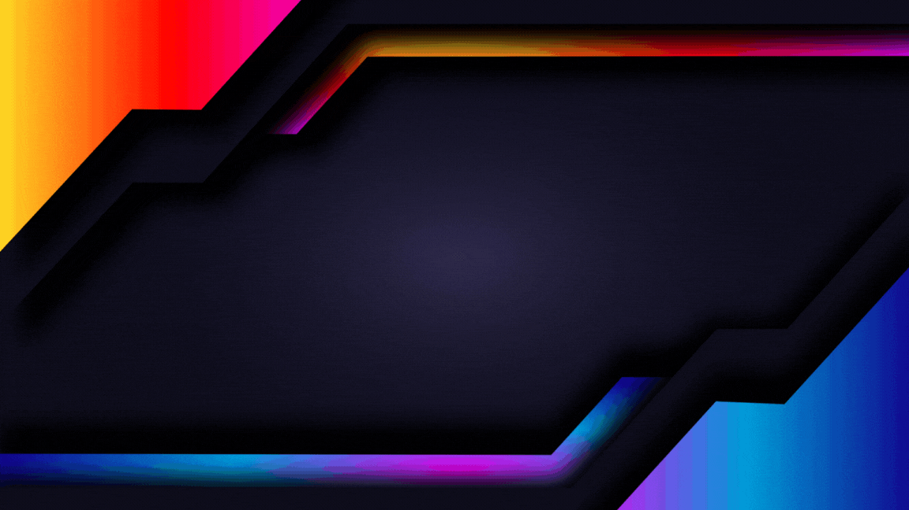
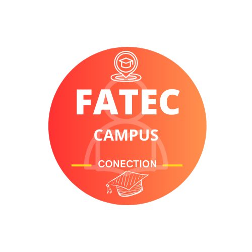

# 🎨 Kaique Mendes - Portfólio de Design Gráfico  

Bem-vindo ao meu portfólio de design gráfico! Aqui você encontrará projetos criados com o Canva, refletindo minha criatividade, atenção aos detalhes e habilidades em comunicação visual.

  

---

## 🖌️ Sobre Mim  
Sou apaixonado por design gráfico e acredito no poder de uma boa comunicação visual. Meu objetivo é criar peças que sejam não apenas esteticamente agradáveis, mas também eficientes em transmitir mensagens de forma clara e impactante.  

Neste portfólio, você encontrará:  
- **Identidades visuais**  
- **Banners promocionais**  
- **Logotipos**  

Cada projeto conta uma história, e estou animado para compartilhar a minha com você.

---

## 📂 Projetos  

### 1️⃣ **Logo para Revendedora de Produtos**  
- **Descrição:** Desenvolvimento de uma identidade visual que reflete confiança e profissionalismo.  
- **Ferramentas:** Canva  
  

---  

### 2️⃣ **Logo Fatec Campus**  
- **Descrição:** Criada como parte de um projeto pessoal, esta logo representa uma rede social acadêmica para alunos da FATEC.  
- **Ferramentas:** Canva  
  

---  

### 3️⃣ **Banner Promocional para Bar**  
- **Descrição:** Design de um banner promocional para a inauguração de um bar, destacando ofertas especiais e o ambiente acolhedor.  
- **Ferramentas:** Canva  
  

---

## 💼 Contato  
Gostou do meu trabalho? Vamos conversar!  
- **Email:** [kaiquemendesn10@gmail.com](mailto:kaiquemendesn10@gmail.com)  
- **LinkedIn:** [linkedin.com/in/kaique-mendes-813208186/](https://www.linkedin.com/in/kaique-mendes-813208186/)  

Estou sempre aberto a novas oportunidades e colaborações. Obrigado por visitar meu portfólio!
